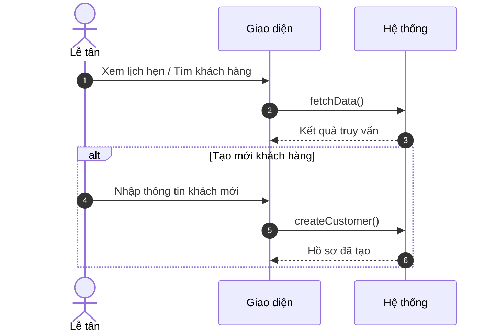
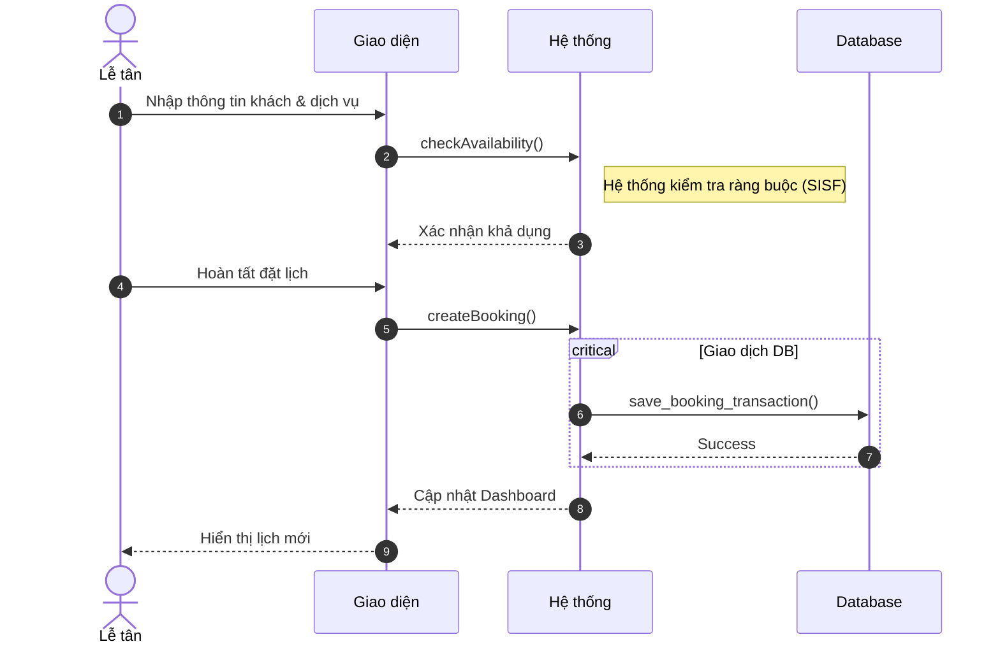
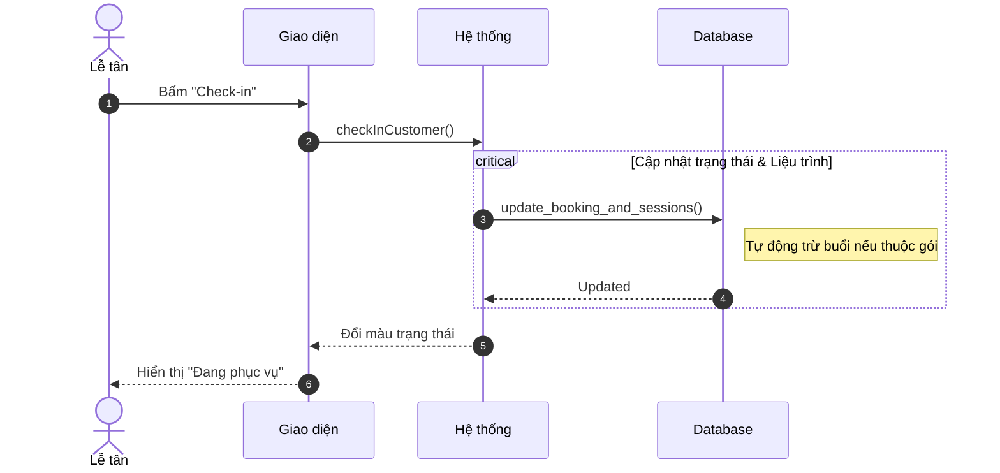
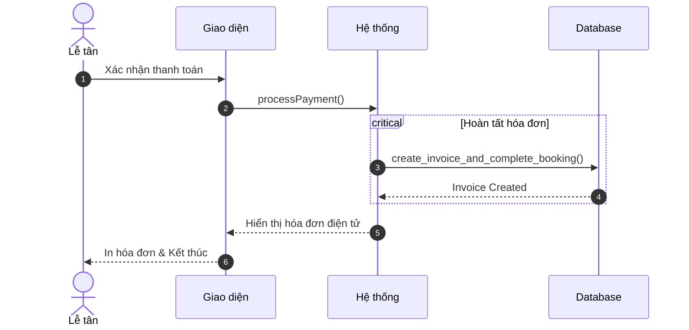
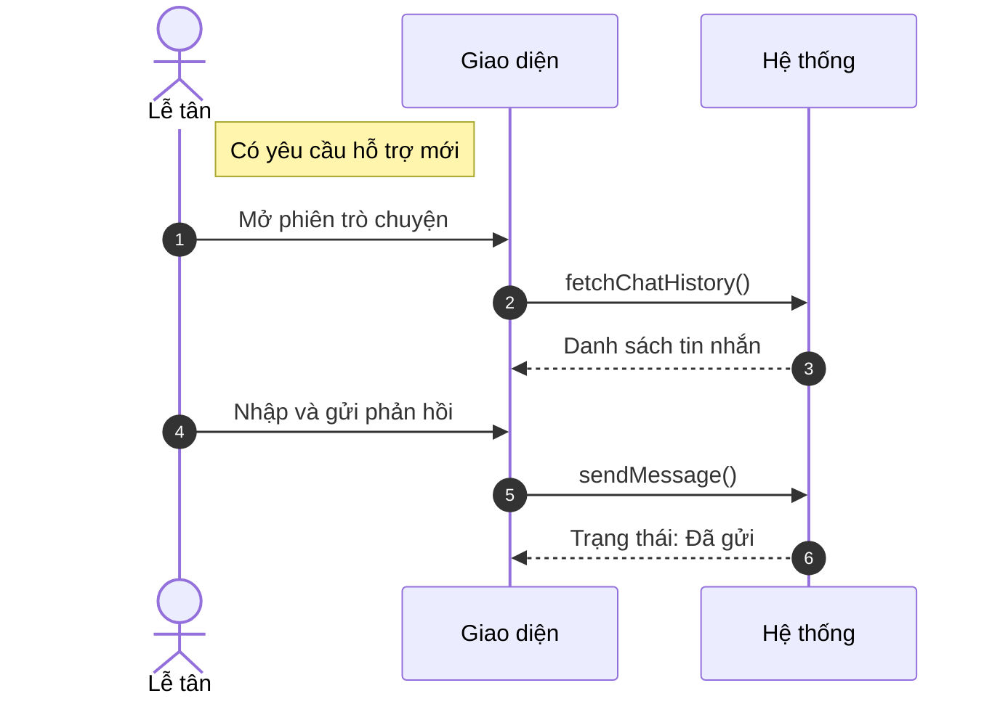
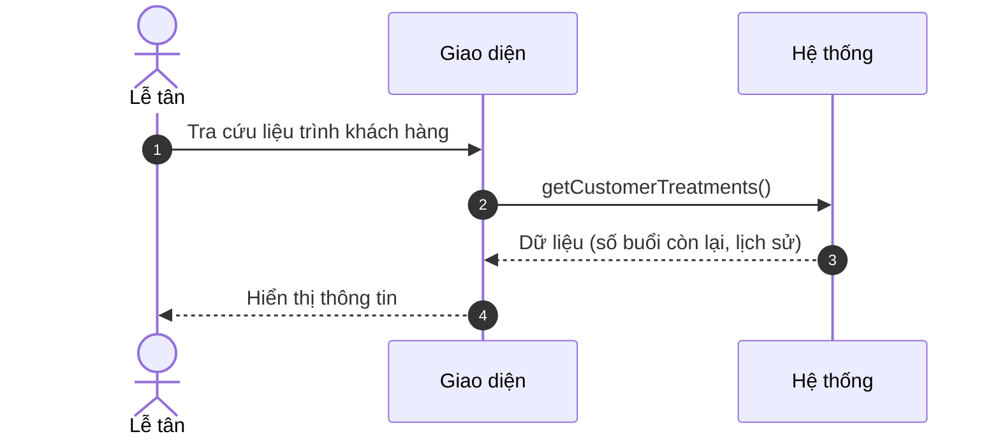
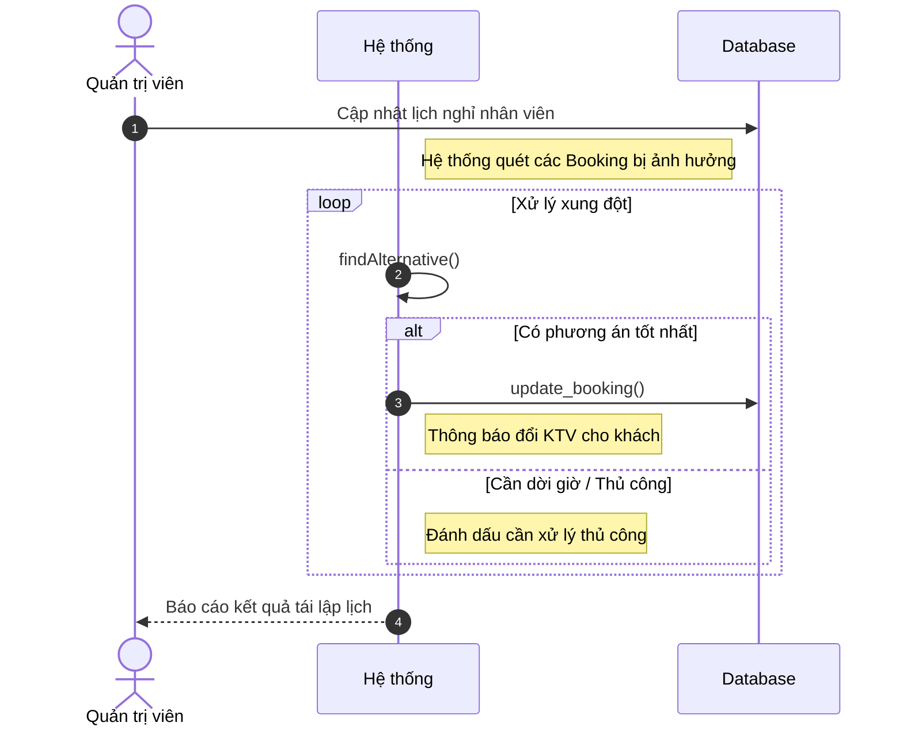

# Sơ đồ Tuần tự Rút gọn: Hoạt động Lễ tân

Tài liệu này trình bày các sơ đồ tuần tự tối giản cho các quy trình nghiệp vụ của Lễ tân.

---

### 3.1. Quản lý lịch hẹn & Hồ sơ (B1.1, B1.2)

---

### 3.2. Tạo lịch hẹn thủ công (B1.3)

---

### 3.3. Xác nhận khách đến & Trừ liệu trình (B1.4)

---

### 3.4. Xử lý thanh toán (B1.5)

---

### 3.5. Phản hồi hỗ trợ trò chuyện (B1.6)

---

### 3.6. Theo dõi tiến độ liệu trình (B1.7)

---

### 3.7. Tái lập lịch tự động (B1.8)

