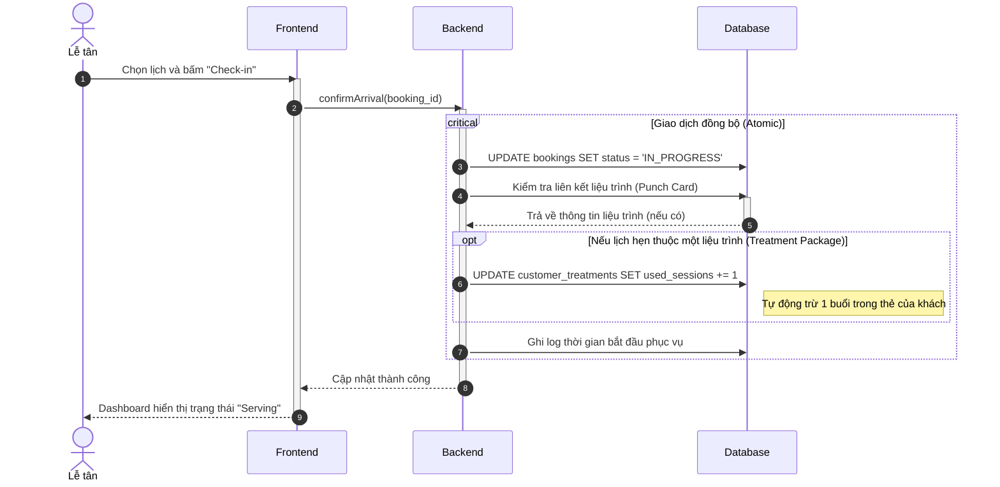
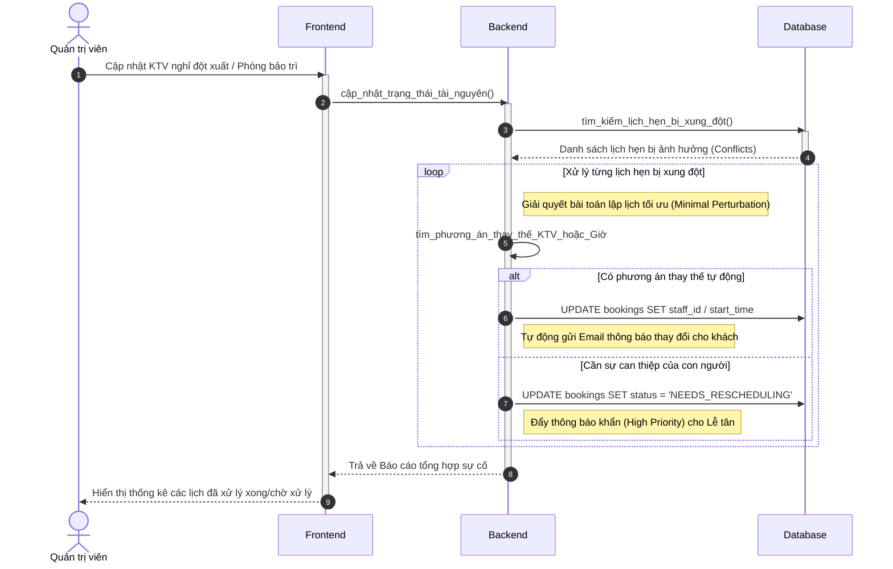

# Sequence Diagram: Receptionist Module (Simplified)

---

### 3.1. Xác nhận khách đến & Trừ liệu trình (B1.4)

```mermaid
sequenceDiagram
    autonumber
    actor LT as Lễ tân
    participant FE as Frontend
    participant BE as Backend
    participant DB as Database

    LT->>FE: Chọn lịch và bấm "Check-in"
    activate FE
    FE->>BE: confirmArrival(booking_id)
    activate BE

    critical Giao dịch đồng bộ (Atomic)
        BE->>DB: UPDATE bookings SET status = 'IN_PROGRESS'
        BE->>DB: Kiểm tra liên kết liệu trình (Punch Card)
        activate DB
        DB-->>BE: Trả về thông tin liệu trình (nếu có)
        deactivate DB

        opt Nếu lịch hẹn thuộc một liệu trình (Treatment Package)
            BE->>DB: UPDATE customer_treatments SET used_sessions += 1
            Note right of DB: Tự động trừ 1 buổi trong thẻ của khách
        end

        BE->>DB: Ghi log thời gian bắt đầu phục vụ
    end

    BE-->>FE: Cập nhật thành công
    deactivate BE
    FE-->>LT: Dashboard hiển thị trạng thái "Serving"
    deactivate FE
```

---

### 3.2. Tái lập lịch tự động khi có sự cố (B1.8)

```mermaid
sequenceDiagram
    autonumber
    actor Admin as Quản trị viên
    participant FE as Frontend
    participant BE as Backend
    participant DB as Database

    Admin->>FE: Cập nhật KTV nghỉ đột xuất / Phòng bảo trì
    activate FE
    FE->>BE: cập_nhật_trạng_thái_tài_nguyên()
    activate BE

    BE->>DB: tìm_kiếm_lịch_hẹn_bị_xung_đột()
    activate DB
    DB-->>BE: Danh sách lịch hẹn bị ảnh hưởng (Conflicts)
    deactivate DB

    loop Xử lý từng lịch hẹn bị xung đột
        Note right of BE: Giải quyết bài toán lập lịch tối ưu (Minimal Perturbation)
        BE->>BE: tìm_phương_án_thay_thế_KTV_hoặc_Giờ

        alt Có phương án thay thế tự động
            BE->>DB: UPDATE bookings SET staff_id / start_time
            Note right of BE: Tự động gửi Email thông báo thay đổi cho khách
        else Cần sự can thiệp của con người
            BE->>DB: UPDATE bookings SET status = 'NEEDS_RESCHEDULING'
            Note right of BE: Đẩy thông báo khẩn (High Priority) cho Lễ tân
        end
    end

    BE-->>FE: Trả về Báo cáo tổng hợp sự cố
    deactivate BE
    FE-->>Admin: Hiển thị thống kê các lịch đã xử lý xong/chờ xử lý
    deactivate FE
```
