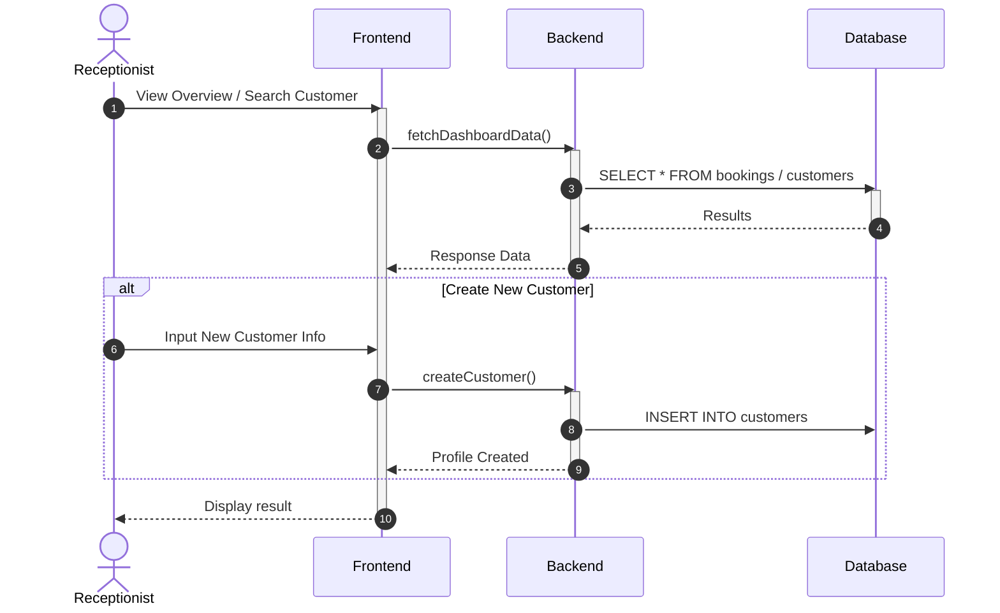
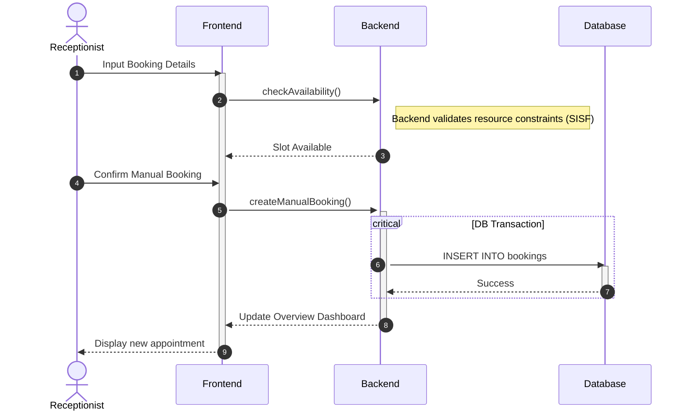
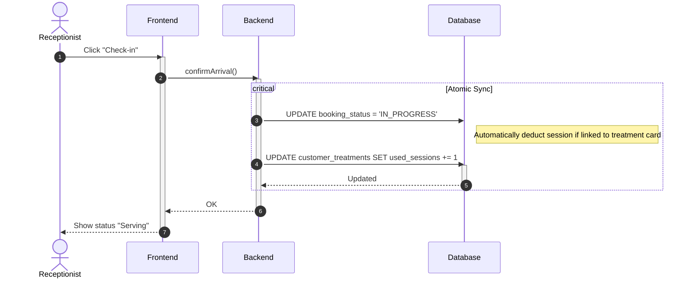
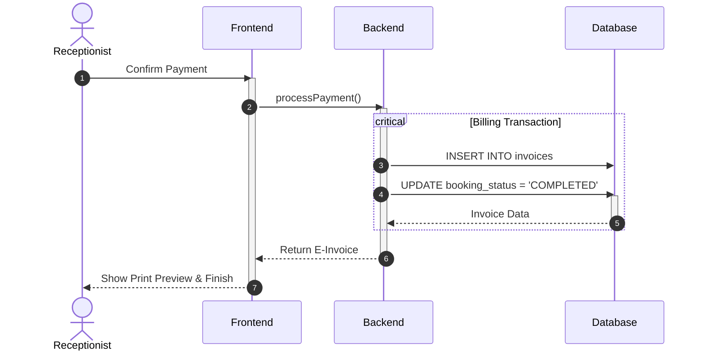
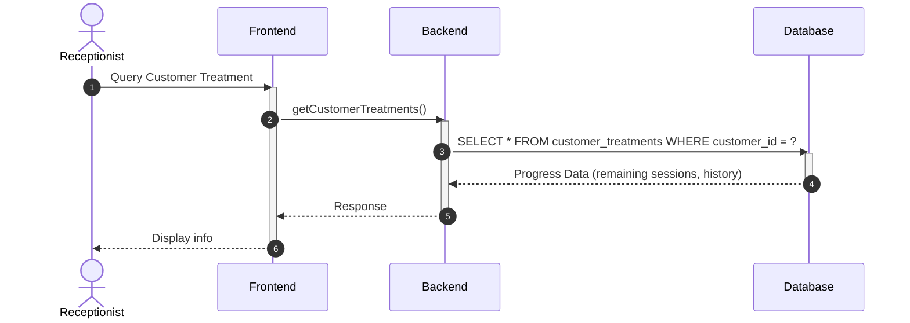
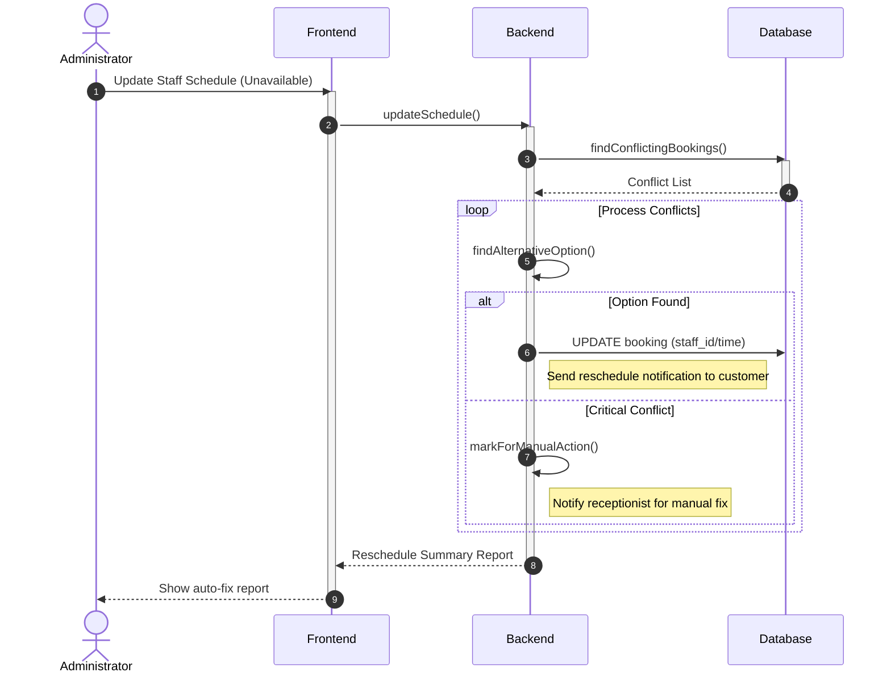

# Sequence Diagram: Receptionist Module (Simplified)

---

### 3.1. Dashboard & Customer Profile (B1.1, B1.2)

---

### 3.2. Manual Booking at Front Desk (B1.3)

---

### 3.3. Customer Check-in & Treatment Deduction (B1.4)

---

### 3.4. Payment Processing & Billing (B1.5)

---

### 3.5. Treatment Progress Tracking (B1.7)

---

### 3.6. Auto Reschedule on Conflict (B1.8)

