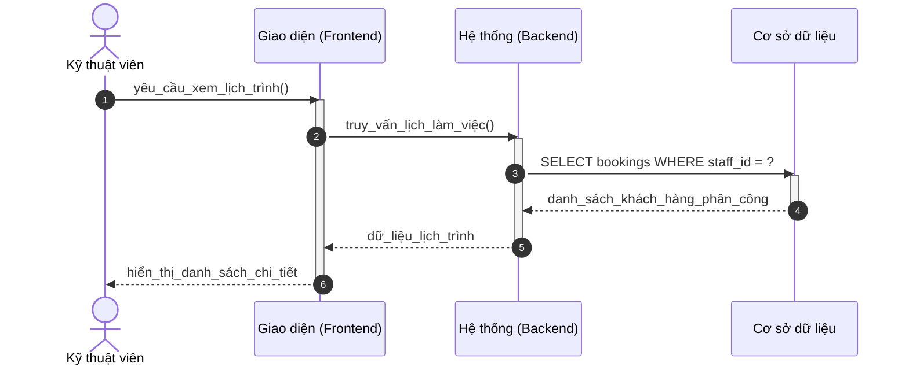
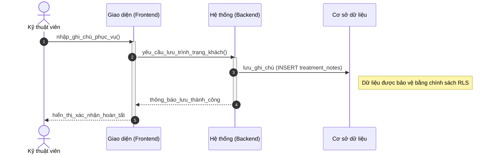

# Sơ đồ Tuần tự: Hoạt động Kỹ thuật viên (Chuẩn học thuật)

Tài liệu này trình bày các luồng thông tin phản hồi giữa Kỹ thuật viên và hệ thống trong quá trình phục vụ khách hàng.

---

### 3.1. Xem lịch phân công cá nhân (B2.1)

---

### 3.2. Ghi chú chuyên môn sau buổi hẹn (B2.3)

