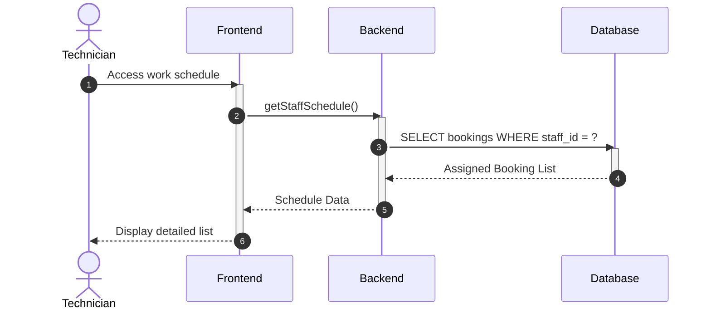
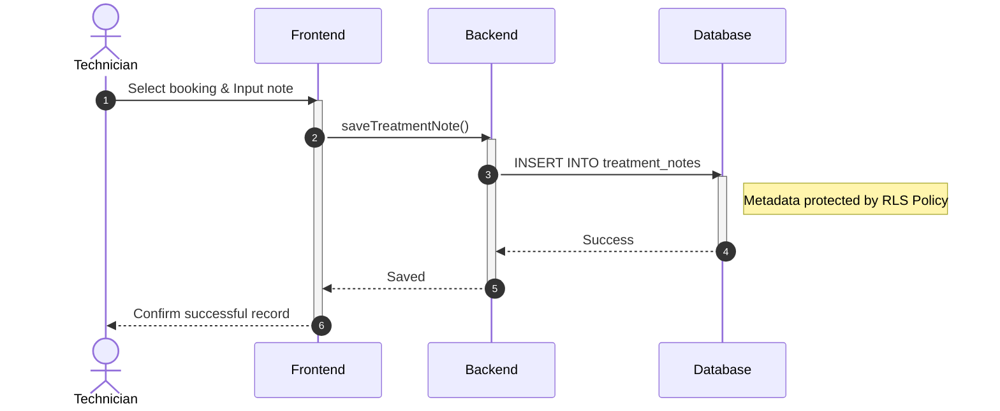

# Sequence Diagram: Technician Module (Simplified)

---

### 3.1. View Personal Work Schedule (B2.1)

```mermaid
sequenceDiagram
    autonumber
    actor KTV as Technician
    participant FE as Frontend
    participant BE as Backend
    participant DB as Database

    KTV->>FE: Access work schedule
    activate FE
    FE->>BE: getStaffSchedule()
    activate BE
    BE->>DB: SELECT bookings WHERE staff_id = ?
    activate DB
    DB-->>BE: Assigned Booking List
    deactivate DB
    BE-->>FE: Schedule Data
    deactivate BE
    FE-->>KTV: Display detailed list
    deactivate FE
```

---

### 3.2. Record Treatment Note (B2.3)

```mermaid
sequenceDiagram
    autonumber
    actor KTV as Technician
    participant FE as Frontend
    participant BE as Backend
    participant DB as Database

    KTV->>FE: Select booking & Input note
    activate FE
    FE->>BE: saveTreatmentNote()
    activate BE

    BE->>DB: INSERT INTO treatment_notes
    activate DB
    Note right of DB: Metadata protected by RLS Policy

    DB-->>BE: Success
    deactivate DB
    BE-->>FE: Saved
    deactivate BE
    FE-->>KTV: Confirm successful record
    deactivate FE
```
