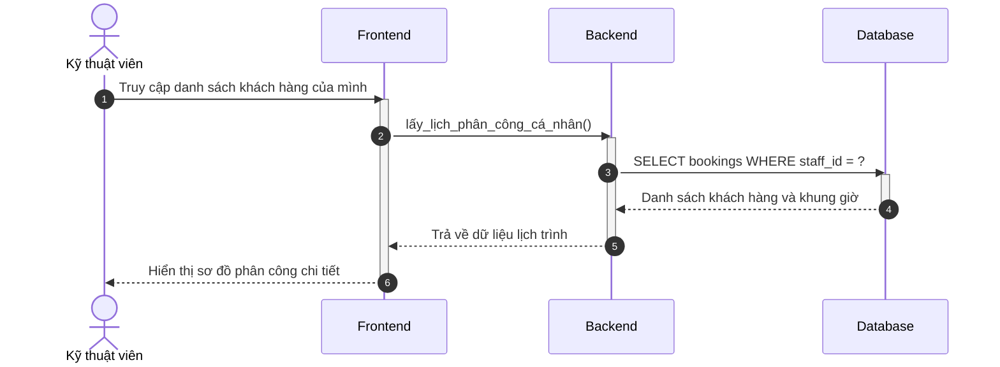
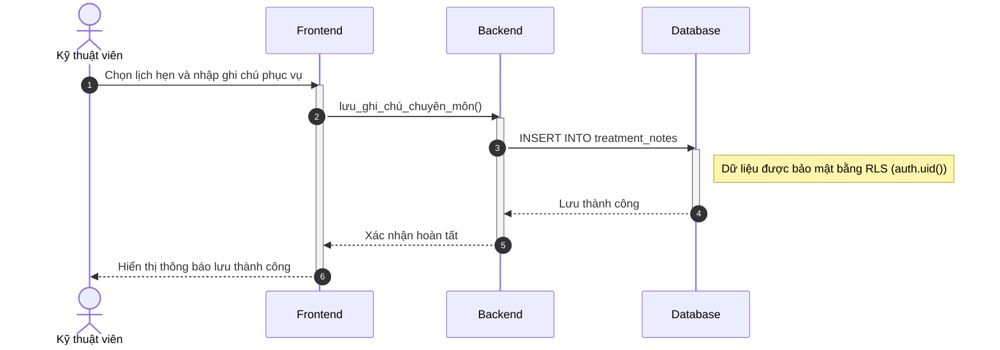

# Sequence Diagram: Technician Module (Simplified)

---

### 3.1. Xem lịch phân công dịch vụ (B2.1)

```mermaid
sequenceDiagram
    autonumber
    actor KTV as Kỹ thuật viên
    participant FE as Frontend
    participant BE as Backend
    participant DB as Database

    KTV->>FE: Truy cập danh sách khách hàng của mình
    activate FE
    FE->>BE: lấy_lịch_phân_công_cá_nhân()
    activate BE
    BE->>DB: SELECT bookings WHERE staff_id = ?
    activate DB
    DB-->>BE: Danh sách khách hàng và khung giờ
    deactivate DB
    BE-->>FE: Trả về dữ liệu lịch trình
    deactivate BE
    FE-->>KTV: Hiển thị sơ đồ phân công chi tiết
    deactivate FE
```

---

### 3.2. Ghi chú chuyên môn sau buổi hẹn (B2.3)

```mermaid
sequenceDiagram
    autonumber
    actor KTV as Kỹ thuật viên
    participant FE as Frontend
    participant BE as Backend
    participant DB as Database

    KTV->>FE: Chọn lịch hẹn và nhập ghi chú phục vụ
    activate FE
    FE->>BE: lưu_ghi_chú_chuyên_môn()
    activate BE

    BE->>DB: INSERT INTO treatment_notes
    activate DB
    Note right of DB: Dữ liệu được bảo mật bằng RLS (auth.uid())

    DB-->>BE: Lưu thành công
    deactivate DB
    BE-->>FE: Xác nhận hoàn tất
    deactivate BE
    FE-->>KTV: Hiển thị thông báo lưu thành công
    deactivate FE
```
