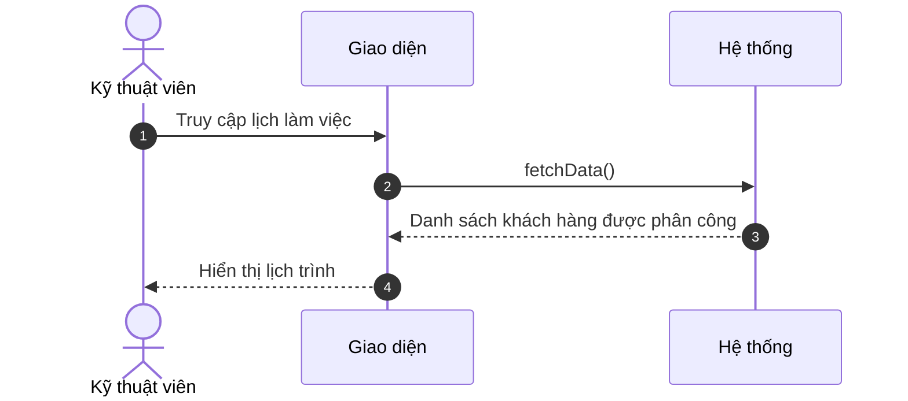
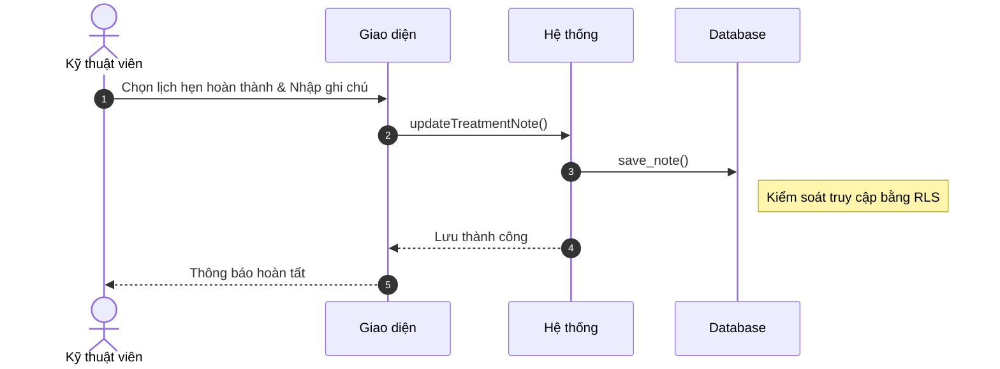

# Sơ đồ Tuần tự Rút gọn: Hoạt động Kỹ thuật viên

Tài liệu này trình bày các sơ đồ tuần tự tối giản dành cho Kỹ thuật viên.

---

### 3.1. Xem lịch làm việc cá nhân (B2.1)

---

### 3.2. Ghi chú chuyên mốn sau buổi hẹn (B2.3)

