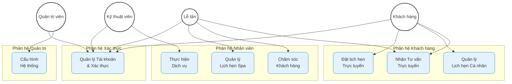
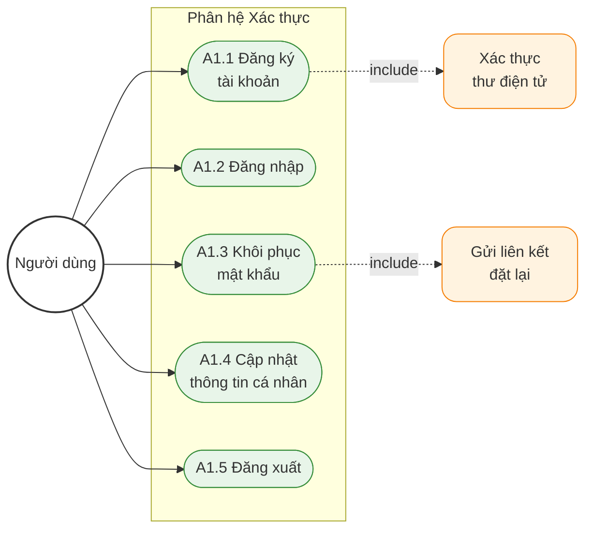
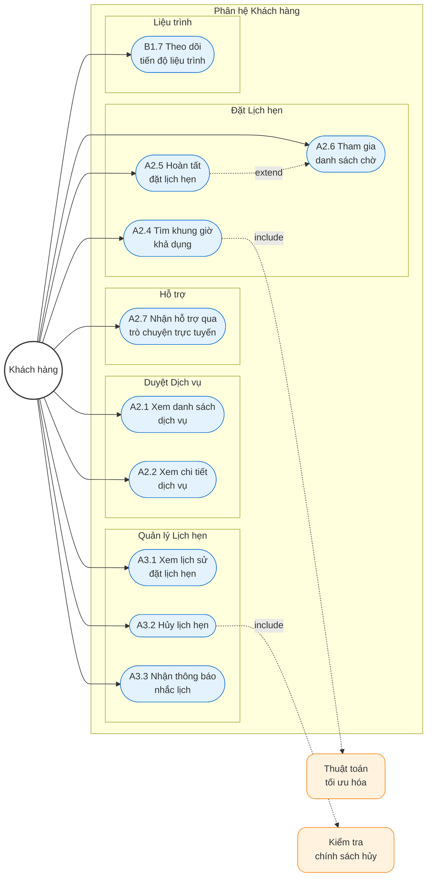
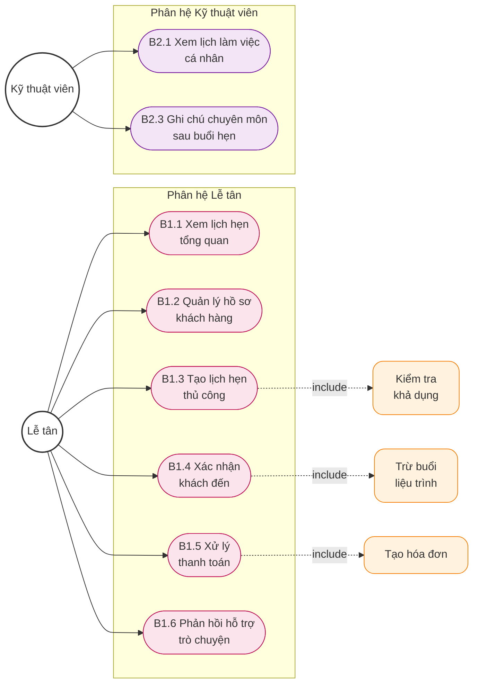
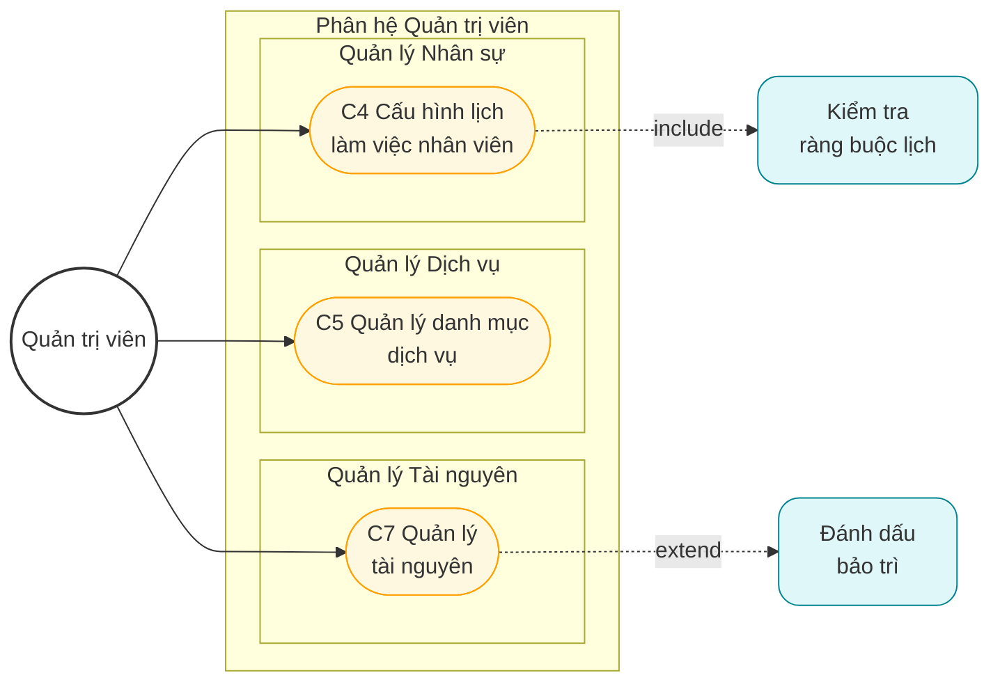

# Sơ đồ Ca Sử dụng Hệ thống Synapse

Tài liệu này trình bày sơ đồ ca sử dụng (Use Case Diagram) tổng quát và các sơ đồ phân rã theo từng phân hệ chức năng.

---

## 1. Sơ đồ Ca Sử dụng Tổng quát

Sơ đồ này thể hiện cái nhìn toàn cảnh về các tác nhân và nhóm chức năng chính của hệ thống.

**Hình 3.1: Sơ đồ ca sử dụng tổng quát hệ thống Synapse**

---

## 2. Sơ đồ Phân rã: Phân hệ Xác thực

**Hình 3.2: Sơ đồ ca sử dụng phân hệ Xác thực**

| Mã | Tên ca sử dụng | Mô tả ngắn |
|----|----------------|------------|
| A1.1 | Đăng ký tài khoản | Tạo tài khoản mới cho khách hàng |
| A1.2 | Đăng nhập | Xác thực để truy cập hệ thống |
| A1.3 | Khôi phục mật khẩu | Đặt lại mật khẩu qua thư điện tử |
| A1.4 | Cập nhật thông tin cá nhân | Chỉnh sửa hồ sơ người dùng |
| A1.5 | Đăng xuất | Kết thúc phiên làm việc |

---

## 3. Sơ đồ Phân rã: Phân hệ Khách hàng

**Hình 3.3: Sơ đồ ca sử dụng phân hệ Khách hàng**

| Mã | Tên ca sử dụng | Mô tả ngắn |
|----|----------------|------------|
| A2.1 | Xem danh sách dịch vụ | Duyệt các dịch vụ Spa cung cấp |
| A2.2 | Xem chi tiết dịch vụ | Xem thông tin đầy đủ một dịch vụ |
| A2.4 | Tìm khung giờ khả dụng | Tìm giờ trống với thuật toán thông minh |
| A2.5 | Hoàn tất đặt lịch hẹn | Xác nhận và tạo lịch hẹn |
| A2.6 | Tham gia danh sách chờ | Đăng ký nhận thông báo khi có chỗ |
| A2.7 | Nhận hỗ trợ trò chuyện | Tư vấn trực tuyến với lễ tân |
| A3.1 | Xem lịch sử đặt lịch | Xem các lịch hẹn đã đặt |
| A3.2 | Hủy lịch hẹn | Hủy lịch theo chính sách |
| A3.3 | Nhận thông báo nhắc lịch | Nhận nhắc nhở trước giờ hẹn |
| B1.7 | Theo dõi tiến độ liệu trình | Xem số buổi còn lại của liệu trình |

---

## 4. Sơ đồ Phân rã: Phân hệ Lễ tân & Kỹ thuật viên

**Hình 3.4: Sơ đồ ca sử dụng phân hệ Lễ tân và Kỹ thuật viên**

### Phân hệ Lễ tân

| Mã | Tên ca sử dụng | Mô tả ngắn |
|----|----------------|------------|
| B1.1 | Xem lịch hẹn tổng quan | Theo dõi toàn bộ lịch hẹn Spa |
| B1.2 | Quản lý hồ sơ khách hàng | Tìm kiếm, xem, cập nhật hồ sơ |
| B1.3 | Tạo lịch hẹn thủ công | Đặt lịch cho khách tại quầy |
| B1.4 | Xác nhận khách đến | Ghi nhận khách có mặt, trừ liệu trình |
| B1.5 | Xử lý thanh toán | Thu phí và tạo hóa đơn |
| B1.6 | Phản hồi hỗ trợ trò chuyện | Phản hồi khách qua trò chuyện |

### Phân hệ Kỹ thuật viên

| Mã | Tên ca sử dụng | Mô tả ngắn |
|----|----------------|------------|
| B2.1 | Xem lịch làm việc cá nhân | Xem khách hàng được phân công |
| B2.3 | Ghi chú chuyên môn | Ghi lại tình trạng khách hàng |

---

## 5. Sơ đồ Phân rã: Phân hệ Quản trị viên

**Hình 3.5: Sơ đồ ca sử dụng phân hệ Quản trị viên**

| Mã | Tên ca sử dụng | Mô tả ngắn |
|----|----------------|------------|
| C4 | Cấu hình lịch làm việc | Phân ca và ngày nghỉ nhân viên |
| C5 | Quản lý danh mục dịch vụ | Thêm, sửa, vô hiệu hóa dịch vụ |
| C7 | Quản lý tài nguyên | Quản lý phòng, giường, thiết bị |

---

## 6. Tổng hợp Ca Sử dụng theo Tác nhân

| Tác nhân | Số ca sử dụng | Mã ca sử dụng |
|----------|---------------|---------------|
| Khách hàng | 10 | A2.1-2, A2.4-7, A3.1-3, B1.7 |
| Lễ tân | 6 | B1.1-6 |
| Kỹ thuật viên | 2 | B2.1, B2.3 |
| Quản trị viên | 3 | C4, C5, C7 |
| **Tổng cộng** | **21** | *(không tính Xác thực)* |

> **Ghi chú:** Các ca sử dụng A1.1-A1.5 (Phân hệ Xác thực) được sử dụng chung cho tất cả tác nhân.

---

*Lưu ý: Các sơ đồ được vẽ bằng Mermaid và tuân thủ ký hiệu UML tiêu chuẩn cho sơ đồ ca sử dụng.*
