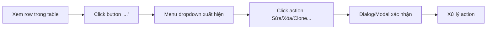
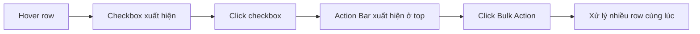

# Báo Cáo Đánh Giá Table UX/UI

**Ngày**: 2025-12-05
**Phạm vi**: Toàn bộ Table component trong frontend

---

## 1. Tổng Quan Các Table Hiện Tại

### 1.1. Danh Sách Table Components

| Component | Vị trí | Mục đích |
|-----------|--------|----------|
| `DataTable` | `shared/ui/custom/data-table.tsx` | Base component chung |
| `ResourceTable` | `features/resources/components/resource-table.tsx` | Quản lý phòng/thiết bị |
| `StaffTable` | `features/staff/components/staff-list/staff-table.tsx` | Quản lý nhân viên |
| `ServiceTable` | `features/services/components/service-table.tsx` | Quản lý dịch vụ |
| `SkillTable` | `features/services/components/skill-table.tsx` | Quản lý kỹ năng |
| `PermissionMatrix` | `features/staff/components/permissions/permission-matrix.tsx` | Ma trận phân quyền |

---

## 2. Phân Tích Workflow Thao Tác Hiện Tại

### 2.1. Pattern Hiện Tại: Dropdown Menu Actions



### 2.2. Vấn Đề Với Workflow Hiện Tại

> [!WARNING]
> **Quá nhiều bước click để thực hiện một action đơn giản**

| Vấn đề | Chi tiết | Tham chiếu UX Guideline |
|--------|----------|-------------------------|
| **Nhiều bước click** | Cần 3-4 clicks để sửa một item: Button → Menu → Edit → Dialog | #91: "Editing one by one is tedious" |
| **Không có Bulk Actions** | Phải thao tác từng row một, không hỗ trợ multi-select | #91: "Allow multi-select and bulk edit" |
| **Không có Row Selection** | Không có checkbox để chọn nhiều row | Best practice: Checkbox on hover |
| **Menu ẩn** | User không biết có những action nào cho đến khi click vào "..." | Best practice: Visual affordance |

### 2.3. Chi Tiết Từng Table

#### ResourceTable
- **Actions:** Edit (via Dialog), Delete (via AlertDialog)
- **Pattern:** Icon buttons inline (Pencil, Trash) + ResourceDialog
- **Vấn đề:** Delete không có undo, Alert dialog có thể bỏ click

#### StaffTable & ServiceTable
- **Actions:** Edit, Clone, Delete (via DropdownMenu)
- **Pattern:** MoreHorizontal button → DropdownMenu → Action
- **Vấn đề:** Actions ẩn sau menu, không direct access

#### SkillTable
- **Actions:** Edit, Delete (via DropdownMenu)
- **Pattern:** Giống StaffTable/ServiceTable
- **Vấn đề:** Tương tự

---

## 3. Đề Xuất Cải Tiến

### 3.1. Pattern Mới: Contextual Action Bar + Row Selection



### 3.2. Các Cải Tiến Đề Xuất

#### 🔵 Option A: Quick Actions (Inline Icons)
**Mô tả:** Hiển thị các icon action quan trọng nhất trực tiếp trên hover, các action phụ vẫn nằm trong menu.

```diff
- <Button variant="ghost"><MoreHorizontal /></Button>
+ <div className="opacity-0 group-hover:opacity-100 flex gap-1">
+   <Button variant="ghost" size="icon"><Pencil /></Button>
+   <Button variant="ghost" size="icon"><Trash /></Button>
+   <DropdownMenu>
+     <DropdownMenuTrigger><MoreHorizontal /></DropdownMenuTrigger>
+     <!-- Actions phụ: Clone, Archive... -->
+   </DropdownMenu>
+ </div>
```

**Ưu điểm:**
- Direct access cho action thường dùng (1 click)
- Vẫn giữ được actions phụ trong menu
- Giao diện gọn khi không hover

**Nhược điểm:**
- Không hỗ trợ bulk actions
- Vẫn cần hover để thấy actions

---

#### 🔵 Option B: Row Selection + Floating Action Bar
**Mô tả:** Thêm checkbox selection, khi có row được chọn thì hiện Action Bar floating ở bottom.

```tsx
// Floating Action Bar component
function TableActionBar({ selectedCount, onDelete, onExport }) {
  if (selectedCount === 0) return null;

  return (
    <div className="fixed bottom-6 left-1/2 -translate-x-1/2 z-50
                    bg-background/95 backdrop-blur border rounded-xl
                    shadow-lg px-6 py-3 flex items-center gap-4">
      <span className="text-sm font-medium">
        Đã chọn {selectedCount} mục
      </span>
      <div className="flex gap-2">
        <Button variant="outline" onClick={onExport}>
          <Download className="h-4 w-4 mr-2" />
          Xuất
        </Button>
        <Button variant="destructive" onClick={onDelete}>
          <Trash className="h-4 w-4 mr-2" />
          Xóa
        </Button>
      </div>
      <Button variant="ghost" size="sm" onClick={onDeselectAll}>
        Bỏ chọn
      </Button>
    </div>
  );
}
```

**Ưu điểm:**
- Hỗ trợ bulk actions (xóa nhiều, export...)
- UX hiện đại, theo trend 2024
- Tiết kiệm thời gian cho admin

**Nhược điểm:**
- Cần refactor DataTable và tất cả tables
- Phức tạp hơn về state management

---

#### 🔵 Option C: Click-to-Edit Row (Inline Editing Light)
**Mô tả:** Click vào row để mở quick edit panel bên phải (Slide-over), hoặc expand row để edit inline.

```tsx
// Click row → expand edit form inline
<AnimatedTableRow
  onClick={() => setExpandedId(item.id)}
>
  {/* Row content */}
  {expandedId === item.id && (
    <motion.div className="col-span-full bg-muted/50 p-4">
      <QuickEditForm item={item} onClose={() => setExpandedId(null)} />
    </motion.div>
  )}
</AnimatedTableRow>
```

**Ưu điểm:**
- Giảm context switching (không cần modal)
- Edit nhanh hơn
- Phù hợp với simple edits

**Nhược điểm:**
- Không phù hợp với form phức tạp
- Có thể làm table dài khi expand

---

### 3.3. So Sánh Các Option

| Tiêu chí | Option A | Option B | Option C |
|----------|----------|----------|----------|
| **Độ phức tạp triển khai** | Thấp | Trung bình | Trung bình |
| **Hỗ trợ Bulk Actions** | ❌ | ✅ | ❌ |
| **Giảm số click** | ⭐⭐ | ⭐⭐⭐ | ⭐⭐⭐ |
| **Phù hợp mobile** | ⭐⭐ | ⭐ | ⭐⭐⭐ |
| **Breaking changes** | Thấp | Cao | Trung bình |

---

## 4. Khuyến Nghị

> [!IMPORTANT]
> **Đề xuất: Kết hợp Option A + Option B**

### Phase 1: Quick Actions (Option A)
- Triển khai nhanh, ít breaking changes
- Áp dụng cho các action phổ biến: Edit, Delete
- Thời gian: 1-2 ngày

### Phase 2: Row Selection + Action Bar (Option B)
- Thêm checkbox column vào `DataTable`
- Tạo `TableActionBar` component chung
- Áp dụng cho các table cần bulk operations
- Thời gian: 3-5 ngày

---

## 5. Tham Chiếu

### 5.1. Files Cần Chỉnh Sửa

**Core Components:**
- [data-table.tsx](file:///e:/Synapse/frontend/src/shared/ui/custom/data-table.tsx)
- [animated-table-row.tsx](file:///e:/Synapse/frontend/src/shared/ui/custom/animated-table-row.tsx)

**Feature Tables:**
- [resource-table.tsx](file:///e:/Synapse/frontend/src/features/resources/components/resource-table.tsx)
- [staff-table.tsx](file:///e:/Synapse/frontend/src/features/staff/components/staff-list/staff-table.tsx)
- [service-table.tsx](file:///e:/Synapse/frontend/src/features/services/components/service-table.tsx)
- [skill-table.tsx](file:///e:/Synapse/frontend/src/features/services/components/skill-table.tsx)

**Action Components:**
- [service-actions.tsx](file:///e:/Synapse/frontend/src/features/services/components/service-actions.tsx)
- [staff-actions.tsx](file:///e:/Synapse/frontend/src/features/staff/components/staff-list/staff-actions.tsx)

### 5.2. UX Guidelines Áp Dụng

- **#91**: Bulk Actions - "Allow multi-select and bulk edit"
- **#35**: Confirmation Dialogs - "Confirm before delete/irreversible actions"
- **#34**: Success Feedback - "Show success message or visual change"
- **#29**: Hover States - "Change cursor and add subtle visual change"

---

## 6. Kết Luận

Workflow thao tác table hiện tại đòi hỏi quá nhiều bước click và không hỗ trợ bulk actions. Đề xuất triển khai theo 2 phase:
1. **Quick Actions** để giảm số click cho thao tác đơn lẻ
2. **Row Selection + Action Bar** để hỗ trợ bulk operations

Việc triển khai sẽ cải thiện đáng kể UX cho admin khi quản lý dữ liệu, đồng thời tuân thủ các best practices hiện đại năm 2024.
